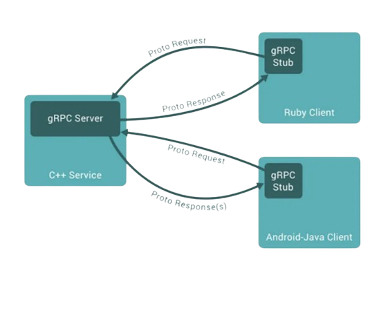

## Google Remote Procedure Call

> 1. construct calculator.py, calculator.proto

> 2. Installing grpc 
`pip install grpcio` 
`pip install grpcio-tools`

> 3. Generating calculator_pb2.py and calculator_pb2_grpc.py 
`python -m grpc_tools.protoc -I. --python_out=. --grpc_python_out=. calculator.proto`

> 4. Create server.py and client.py files

>5. Run server.py and test with client.py or `postman`

+ #### [reference](https://medium.com/engineering-semantics3/a-simplified-guide-to-grpc-in-python-6c4e25f0c506)

